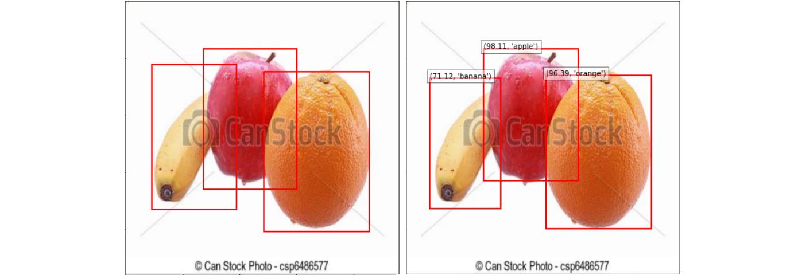
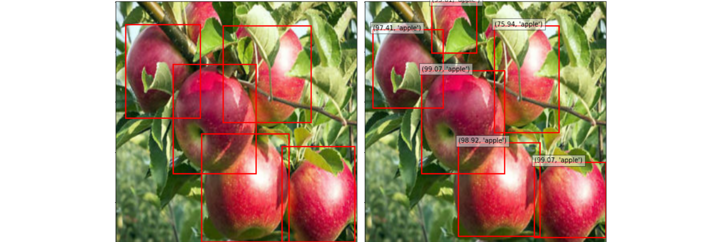
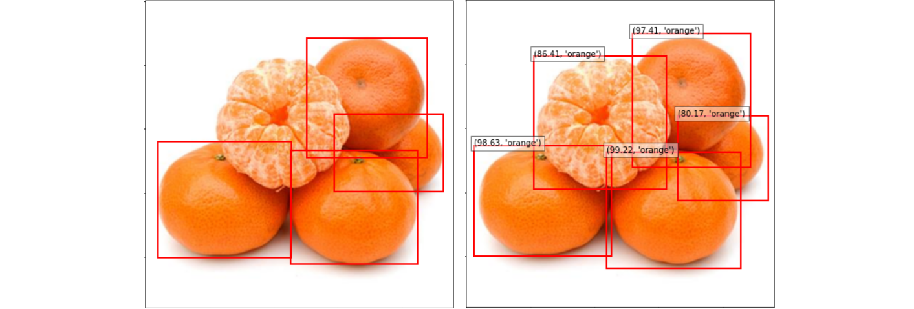

## Fruit recognitions pet-project

This project was completed as a final homework assignment for the course "School of Deep Learning" from MIPT on the topic of detection.

It was required to build a complete pipeline from data preprocessing to demonstration of the learning result with the provision of quality metrics.

As a model, the [FASTERRCNN_RESNET50_FPN](https://pytorch.org/vision/main/models/generated/torchvision.models.detection.fasterrcnn_resnet50_fpn.html) neural network with pre-trained was used and then trained on a [dataset](https://www.kaggle.com/datasets/mbkinaci/fruit-images-for-object-detection) taken from a kaggle.

The data set consists of images of bananas, apples and oranges both individually and together, and a file was also attached to each image.xml, in which instructions were stored which fruit is located in the picture and where - the lower left and upper right corners were indicated in the form of coordinates (see below).

The training results are shown in the pictures from the dataset used for the model test (on the left, in what form they are in the original dataset, on the right, the output of the model):

The results of the training on the photos of the author of the work and the picture from the Internet:

To test the model on your photos and pictures, you need to clone this repository using:
`git clone <HTTPS repository link>`

Assembling the docker image:
`docker build -t det-app .`

Let's create a docker container:
`docker run -p 1234:1234 det-app`

Next, you need to click on the link in the browser:
